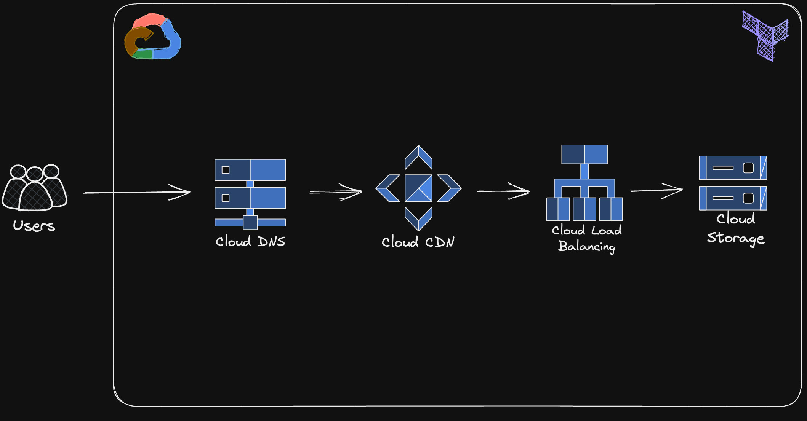
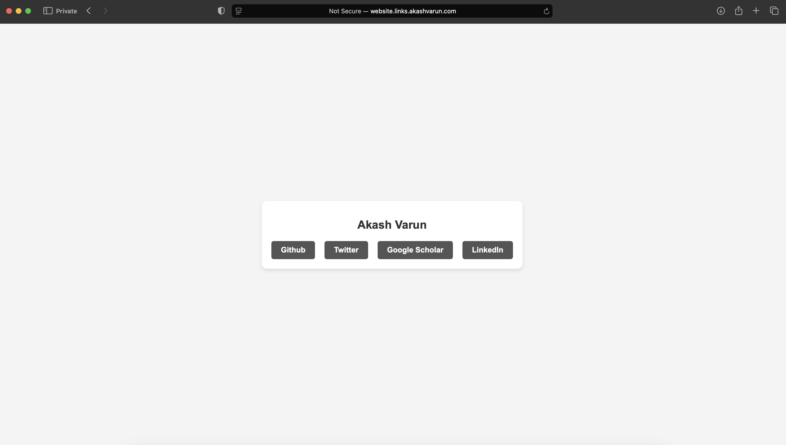

Static Website Deployment via GCP Terraform


## Overview


This project demonstrates how to deploy a static website on Google Cloud Platform (GCP) using Terraform, adhering to Infrastructure as Code (IaC) principles. It covers the setup and management of various GCP resources, including Cloud Storage, Cloud DNS, Cloud CDN, and Cloud Load Balancing.



## Key Components

The project involves deploying the following GCP resources:

- **Cloud Storage**: For hosting website content.
- **Cloud DNS**: For managing domain names.
- **Cloud CDN**: To improve performance through content delivery.
- **Cloud Load Balancer**: For efficient traffic distribution.

## Project Structure

1. **Introduction**: Overview of IaC and Terraform.
2. **GCP Setup**: Setting up your GCP account and enabling necessary APIs.
3. **Terraform Installation**: Installing Terraform and configuring your development environment.
4. **Writing Terraform Code**: Creating the necessary `.tf` files.
5. **Resource Deployment**: Deploying a Google Storage bucket and other resources.
6. **Custom Domain Configuration**: Setting up a custom domain for the website.
7. **Final Deployment**: Deploying all resources to GCP.
8. **Cleanup**: Destroying resources and managing files using `.gitignore`.

## Configuration

Create a file named `terraform.tfvars` in the root directory with the following content:

```hcl
gcp_svc_key = "../project-api-key.json"  # Path to your GCP service account key
gcp_project = "project-id"               # Your GCP project ID
gcp_region = "us-east1"                  # Preferred GCP region
```


## Getting Started

To get started with the project, follow these steps:

1. Clone this repository.
2. Install Terraform and set up your GCP account as specified.
3. Write the necessary Terraform scripts.
4. Deploy your website using the following command:

```bash
terraform init
terraform plan
terraform apply
```

### 5. Verifying Website Deployment

After the resources have been deployed, you can access the website using the domain or IP generated by Terraform. Below is an image showing the deployed website:


## Cleanup

To clean up and destroy all created resources, run:

```bash
terraform destroy
```
